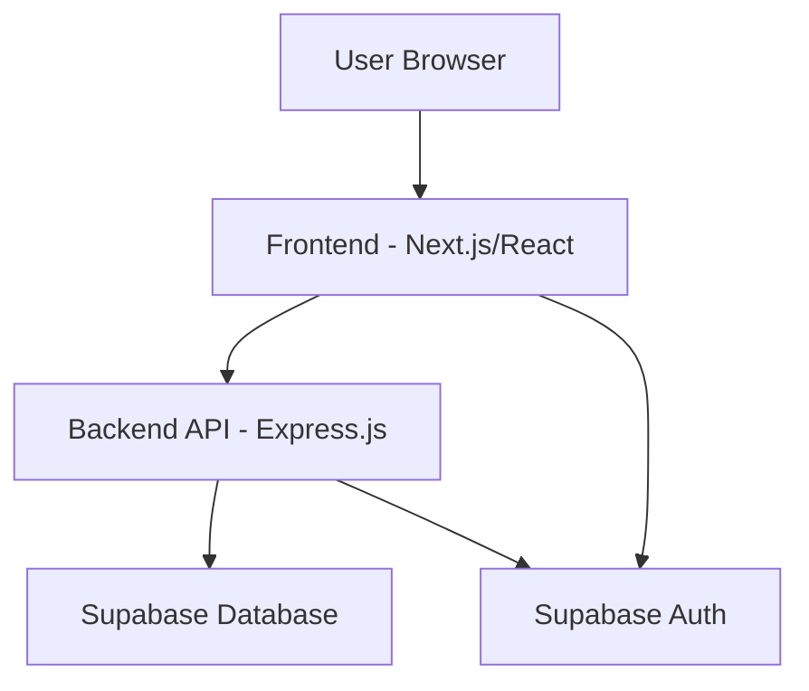

# ProjekSync MVP V1.0 - Design Document

## Overview

ProjekSync adalah platform SaaS berbasis web yang dibangun dengan arsitektur modern full-stack. Platform ini menggunakan Next.js untuk frontend dengan React components, Node.js/Express.js untuk backend API, dan Supabase sebagai database dan authentication provider. Desain ini memungkinkan scalability yang baik dan development experience yang optimal.

## Architecture

### High-Level Architecture



### Technology Stack

**Frontend:**
- Next.js 14+ (App Router)
- React 18+
- TypeScript
- Tailwind CSS untuk styling
- React Hook Form untuk form handling
- React Query/TanStack Query untuk data fetching

**Backend:**
- Node.js 18+
- Express.js
- TypeScript
- Supabase JavaScript Client
- CORS middleware
- Express Rate Limiting

**Database & Authentication:**
- Supabase (PostgreSQL)
- Supabase Auth untuk user management
- Row Level Security (RLS) policies

**Development Tools:**
- ESLint & Prettier
- Husky untuk git hooks
- Environment variables management

## Components and Interfaces

### Frontend Component Structure

```
src/
├── app/                    # Next.js App Router
│   ├── (auth)/            # Authentication routes
│   │   ├── login/
│   │   └── signup/
│   ├── dashboard/         # Protected dashboard routes
│   │   ├── projects/
│   │   ├── clients/
│   │   ├── milestones/
│   │   ├── timesheet/
│   │   ├── invoices/
│   │   ├── contracts/
│   │   ├── expenses/
│   │   ├── communications/
│   │   ├── financial-reports/
│   │   ├── proposals/
│   │   ├── documents/
│   │   └── calendar/
│   └── layout.tsx
├── components/            # Reusable UI components
│   ├── ui/               # Base UI components
│   ├── forms/            # Form components
│   ├── layout/           # Layout components
│   └── dashboard/        # Dashboard-specific components
├── lib/                  # Utility functions
│   ├── supabase.ts      # Supabase client
│   ├── auth.ts          # Auth utilities
│   └── utils.ts         # General utilities
├── hooks/               # Custom React hooks
├── types/               # TypeScript type definitions
└── styles/              # Global styles
```

### Backend API Structure

```
src/
├── routes/              # API route handlers
│   ├── auth.ts         # Authentication routes
│   ├── projects.ts     # Project CRUD operations
│   ├── clients.ts      # Client CRUD operations
│   ├── milestones.ts   # Milestone CRUD operations
│   ├── timesheets.ts   # Timesheet CRUD operations
│   ├── invoices.ts     # Invoice CRUD operations
│   ├── contracts.ts    # Contract CRUD operations
│   ├── expenses.ts     # Expense tracking operations
│   ├── communications.ts # Client communication operations
│   ├── reports.ts      # Financial reports operations
│   ├── proposals.ts    # Proposal and quote operations
│   ├── documents.ts    # Document management operations
│   └── calendar.ts     # Calendar and scheduling operations
├── middleware/          # Express middleware
│   ├── auth.ts         # Authentication middleware
│   ├── validation.ts   # Request validation
│   └── errorHandler.ts # Error handling
├── services/           # Business logic layer
├── types/              # TypeScript interfaces
└── utils/              # Utility functions
```

### API Endpoints Design

**Authentication:**
- `POST /api/auth/signup` - User registration
- `POST /api/auth/login` - User login
- `POST /api/auth/logout` - User logout
- `GET /api/auth/user` - Get current user

**Projects:**
- `GET /api/projects` - Get user's projects
- `POST /api/projects` - Create new project
- `GET /api/projects/:id` - Get project details
- `PUT /api/projects/:id` - Update project
- `DELETE /api/projects/:id` - Delete project

**Clients:**
- `GET /api/clients` - Get user's clients
- `POST /api/clients` - Create new client
- `PUT /api/clients/:id` - Update client
- `DELETE /api/clients/:id` - Delete client

**Milestones:**
- `GET /api/projects/:projectId/milestones` - Get project milestones
- `POST /api/projects/:projectId/milestones` - Create milestone
- `PUT /api/milestones/:id` - Update milestone
- `DELETE /api/milestones/:id` - Delete milestone

**Timesheets:**
- `GET /api/timesheets` - Get user's time entries
- `POST /api/timesheets` - Create time entry
- `PUT /api/timesheets/:id` - Update time entry
- `DELETE /api/timesheets/:id` - Delete time entry
- `GET /api/timesheets/summary` - Get time summary

**Invoices:**
- `GET /api/invoices` - Get user's invoices
- `POST /api/invoices` - Create invoice
- `GET /api/invoices/:id` - Get invoice details
- `PUT /api/invoices/:id` - Update invoice
- `DELETE /api/invoices/:id` - Delete invoice

**Contracts:**
- `GET /api/contracts` - Get user's contracts
- `POST /api/contracts` - Create contract
- `GET /api/contracts/:id` - Get contract details
- `PUT /api/contracts/:id` - Update contract
- `DELETE /api/contracts/:id` - Delete contract

**Expenses:**
- `GET /api/expenses` - Get user's expenses
- `POST /api/expenses` - Create expense entry
- `GET /api/expenses/:id` - Get expense details
- `PUT /api/expenses/:id` - Update expense
- `DELETE /api/expenses/:id` - Delete expense
- `GET /api/expenses/reports` - Get expense reports
- `POST /api/expenses/:id/receipt` - Upload receipt

**Communications:**
- `GET /api/projects/:projectId/messages` - Get project messages
- `POST /api/projects/:projectId/messages` - Send message
- `POST /api/projects/:projectId/files` - Upload project file
- `GET /api/projects/:projectId/files` - Get project files
- `PUT /api/messages/:id/status` - Update message status

**Financial Reports:**
- `GET /api/reports/income` - Get income reports
- `GET /api/reports/expenses` - Get expense reports
- `GET /api/reports/profit-loss` - Get P&L statements
- `GET /api/reports/cash-flow` - Get cash flow projections
- `GET /api/reports/client-analysis` - Get client performance
- `GET /api/reports/tax-summary` - Get tax preparation data

**Proposals:**
- `GET /api/proposals` - Get user's proposals
- `POST /api/proposals` - Create proposal
- `GET /api/proposals/:id` - Get proposal details
- `PUT /api/proposals/:id` - Update proposal
- `DELETE /api/proposals/:id` - Delete proposal
- `POST /api/proposals/:id/convert` - Convert to project
- `GET /api/proposals/templates` - Get proposal templates

**Documents:**
- `GET /api/documents` - Get user's documents
- `POST /api/documents` - Upload document
- `GET /api/documents/:id` - Get document details
- `PUT /api/documents/:id` - Update document
- `DELETE /api/documents/:id` - Delete document
- `GET /api/documents/templates` - Get document templates
- `POST /api/documents/share/:id` - Create share link

**Calendar:**
- `GET /api/calendar/events` - Get calendar events
- `POST /api/calendar/events` - Create calendar event
- `PUT /api/calendar/events/:id` - Update event
- `DELETE /api/calendar/events/:id` - Delete event
- `GET /api/calendar/availability` - Get availability slots
- `POST /api/calendar/time-blocks` - Create time block

## Data Models

### Database Schema

**users (managed by Supabase Auth)**
```sql
-- Supabase Auth handles user table
-- Additional user profile data if needed
CREATE TABLE user_profiles (
  id UUID REFERENCES auth.users(id) PRIMARY KEY,
  full_name TEXT,
  business_name TEXT,
  created_at TIMESTAMP WITH TIME ZONE DEFAULT NOW(),
  updated_at TIMESTAMP WITH TIME ZONE DEFAULT NOW()
);
```

**clients**
```sql
CREATE TABLE clients (
  id UUID DEFAULT gen_random_uuid() PRIMARY KEY,
  user_id UUID REFERENCES auth.users(id) NOT NULL,
  name VARCHAR(255) NOT NULL,
  email VARCHAR(255),
  phone VARCHAR(50),
  address TEXT,
  created_at TIMESTAMP WITH TIME ZONE DEFAULT NOW(),
  updated_at TIMESTAMP WITH TIME ZONE DEFAULT NOW()
);
```

**projects**
```sql
CREATE TABLE projects (
  id UUID DEFAULT gen_random_uuid() PRIMARY KEY,
  user_id UUID REFERENCES auth.users(id) NOT NULL,
  client_id UUID REFERENCES clients(id),
  name VARCHAR(255) NOT NULL,
  description TEXT,
  start_date DATE,
  deadline DATE,
  status VARCHAR(50) DEFAULT 'active',
  created_at TIMESTAMP WITH TIME ZONE DEFAULT NOW(),
  updated_at TIMESTAMP WITH TIME ZONE DEFAULT NOW()
);
```

**milestones**
```sql
CREATE TABLE milestones (
  id UUID DEFAULT gen_random_uuid() PRIMARY KEY,
  project_id UUID REFERENCES projects(id) ON DELETE CASCADE NOT NULL,
  title VARCHAR(255) NOT NULL,
  description TEXT,
  due_date DATE,
  status VARCHAR(50) DEFAULT 'To Do' CHECK (status IN ('To Do', 'In Progress', 'Done')),
  created_at TIMESTAMP WITH TIME ZONE DEFAULT NOW(),
  updated_at TIMESTAMP WITH TIME ZONE DEFAULT NOW()
);
```

**timesheets**
```sql
CREATE TABLE timesheets (
  id UUID DEFAULT gen_random_uuid() PRIMARY KEY,
  user_id UUID REFERENCES auth.users(id) NOT NULL,
  project_id UUID REFERENCES projects(id) ON DELETE CASCADE NOT NULL,
  task_description TEXT NOT NULL,
  date DATE NOT NULL,
  start_time TIME,
  end_time TIME,
  total_hours DECIMAL(5,2) NOT NULL,
  created_at TIMESTAMP WITH TIME ZONE DEFAULT NOW(),
  updated_at TIMESTAMP WITH TIME ZONE DEFAULT NOW()
);
```

**invoices**
```sql
CREATE TABLE invoices (
  id UUID DEFAULT gen_random_uuid() PRIMARY KEY,
  user_id UUID REFERENCES auth.users(id) NOT NULL,
  client_id UUID REFERENCES clients(id) NOT NULL,
  invoice_number VARCHAR(100) UNIQUE NOT NULL,
  issue_date DATE NOT NULL,
  due_date DATE,
  status VARCHAR(50) DEFAULT 'Draft' CHECK (status IN ('Draft', 'Sent', 'Paid', 'Overdue')),
  subtotal DECIMAL(10,2) DEFAULT 0,
  tax_amount DECIMAL(10,2) DEFAULT 0,
  total_amount DECIMAL(10,2) DEFAULT 0,
  notes TEXT,
  created_at TIMESTAMP WITH TIME ZONE DEFAULT NOW(),
  updated_at TIMESTAMP WITH TIME ZONE DEFAULT NOW()
);
```

**invoice_items**
```sql
CREATE TABLE invoice_items (
  id UUID DEFAULT gen_random_uuid() PRIMARY KEY,
  invoice_id UUID REFERENCES invoices(id) ON DELETE CASCADE NOT NULL,
  description TEXT NOT NULL,
  quantity DECIMAL(10,2) DEFAULT 1,
  rate DECIMAL(10,2) NOT NULL,
  amount DECIMAL(10,2) NOT NULL,
  created_at TIMESTAMP WITH TIME ZONE DEFAULT NOW()
);
```

**contracts**
```sql
CREATE TABLE contracts (
  id UUID DEFAULT gen_random_uuid() PRIMARY KEY,
  user_id UUID REFERENCES auth.users(id) NOT NULL,
  client_id UUID REFERENCES clients(id) NOT NULL,
  project_id UUID REFERENCES projects(id),
  contract_number VARCHAR(100) UNIQUE NOT NULL,
  title VARCHAR(255) NOT NULL,
  scope_of_work TEXT NOT NULL,
  deliverables TEXT,
  timeline TEXT,
  payment_terms TEXT,
  contract_value DECIMAL(12,2),
  terms_and_conditions TEXT,
  status VARCHAR(50) DEFAULT 'Draft' CHECK (status IN ('Draft', 'Sent', 'Signed', 'Active', 'Completed')),
  start_date DATE,
  end_date DATE,
  signed_date DATE,
  created_at TIMESTAMP WITH TIME ZONE DEFAULT NOW(),
  updated_at TIMESTAMP WITH TIME ZONE DEFAULT NOW()
);
```

**expenses**
```sql
CREATE TABLE expenses (
  id UUID DEFAULT gen_random_uuid() PRIMARY KEY,
  user_id UUID REFERENCES auth.users(id) NOT NULL,
  amount DECIMAL(10,2) NOT NULL,
  description TEXT NOT NULL,
  category VARCHAR(100) NOT NULL,
  date DATE NOT NULL,
  is_tax_deductible BOOLEAN DEFAULT true,
  receipt_url TEXT,
  receipt_filename VARCHAR(255),
  notes TEXT,
  created_at TIMESTAMP WITH TIME ZONE DEFAULT NOW(),
  updated_at TIMESTAMP WITH TIME ZONE DEFAULT NOW()
);
```

**project_messages**
```sql
CREATE TABLE project_messages (
  id UUID DEFAULT gen_random_uuid() PRIMARY KEY,
  project_id UUID REFERENCES projects(id) ON DELETE CASCADE NOT NULL,
  user_id UUID REFERENCES auth.users(id) NOT NULL,
  message TEXT NOT NULL,
  message_type VARCHAR(50) DEFAULT 'message' CHECK (message_type IN ('message', 'update', 'file_share', 'feedback_request')),
  is_read BOOLEAN DEFAULT false,
  created_at TIMESTAMP WITH TIME ZONE DEFAULT NOW()
);
```

**project_files**
```sql
CREATE TABLE project_files (
  id UUID DEFAULT gen_random_uuid() PRIMARY KEY,
  project_id UUID REFERENCES projects(id) ON DELETE CASCADE NOT NULL,
  user_id UUID REFERENCES auth.users(id) NOT NULL,
  filename VARCHAR(255) NOT NULL,
  file_url TEXT NOT NULL,
  file_size INTEGER,
  file_type VARCHAR(100),
  description TEXT,
  is_deliverable BOOLEAN DEFAULT false,
  download_count INTEGER DEFAULT 0,
  created_at TIMESTAMP WITH TIME ZONE DEFAULT NOW()
);
```

**proposals**
```sql
CREATE TABLE proposals (
  id UUID DEFAULT gen_random_uuid() PRIMARY KEY,
  user_id UUID REFERENCES auth.users(id) NOT NULL,
  client_id UUID REFERENCES clients(id),
  proposal_number VARCHAR(100) UNIQUE NOT NULL,
  title VARCHAR(255) NOT NULL,
  description TEXT,
  services_offered TEXT NOT NULL,
  pricing_model VARCHAR(50) CHECK (pricing_model IN ('hourly', 'fixed', 'milestone')),
  total_amount DECIMAL(12,2),
  estimated_hours INTEGER,
  timeline TEXT,
  terms_and_conditions TEXT,
  status VARCHAR(50) DEFAULT 'Draft' CHECK (status IN ('Draft', 'Sent', 'Viewed', 'Accepted', 'Rejected', 'Expired')),
  sent_date DATE,
  viewed_date DATE,
  response_date DATE,
  expiry_date DATE,
  created_at TIMESTAMP WITH TIME ZONE DEFAULT NOW(),
  updated_at TIMESTAMP WITH TIME ZONE DEFAULT NOW()
);
```

**proposal_items**
```sql
CREATE TABLE proposal_items (
  id UUID DEFAULT gen_random_uuid() PRIMARY KEY,
  proposal_id UUID REFERENCES proposals(id) ON DELETE CASCADE NOT NULL,
  service_name VARCHAR(255) NOT NULL,
  description TEXT,
  quantity DECIMAL(10,2) DEFAULT 1,
  rate DECIMAL(10,2),
  amount DECIMAL(10,2) NOT NULL,
  created_at TIMESTAMP WITH TIME ZONE DEFAULT NOW()
);
```

**documents**
```sql
CREATE TABLE documents (
  id UUID DEFAULT gen_random_uuid() PRIMARY KEY,
  user_id UUID REFERENCES auth.users(id) NOT NULL,
  project_id UUID REFERENCES projects(id),
  client_id UUID REFERENCES clients(id),
  filename VARCHAR(255) NOT NULL,
  file_url TEXT NOT NULL,
  file_size INTEGER,
  file_type VARCHAR(100),
  document_type VARCHAR(100) CHECK (document_type IN ('contract', 'invoice', 'proposal', 'deliverable', 'template', 'brand_asset', 'other')),
  description TEXT,
  tags TEXT[],
  is_template BOOLEAN DEFAULT false,
  share_token VARCHAR(255),
  share_expires_at TIMESTAMP WITH TIME ZONE,
  download_count INTEGER DEFAULT 0,
  created_at TIMESTAMP WITH TIME ZONE DEFAULT NOW(),
  updated_at TIMESTAMP WITH TIME ZONE DEFAULT NOW()
);
```

**calendar_events**
```sql
CREATE TABLE calendar_events (
  id UUID DEFAULT gen_random_uuid() PRIMARY KEY,
  user_id UUID REFERENCES auth.users(id) NOT NULL,
  project_id UUID REFERENCES projects(id),
  client_id UUID REFERENCES clients(id),
  title VARCHAR(255) NOT NULL,
  description TEXT,
  event_type VARCHAR(50) CHECK (event_type IN ('deadline', 'meeting', 'time_block', 'reminder', 'milestone')),
  start_datetime TIMESTAMP WITH TIME ZONE NOT NULL,
  end_datetime TIMESTAMP WITH TIME ZONE NOT NULL,
  is_all_day BOOLEAN DEFAULT false,
  recurrence_rule TEXT,
  reminder_minutes INTEGER DEFAULT 15,
  location TEXT,
  meeting_url TEXT,
  status VARCHAR(50) DEFAULT 'scheduled' CHECK (status IN ('scheduled', 'completed', 'cancelled')),
  created_at TIMESTAMP WITH TIME ZONE DEFAULT NOW(),
  updated_at TIMESTAMP WITH TIME ZONE DEFAULT NOW()
);
```

### Row Level Security (RLS) Policies

Semua tabel akan menggunakan RLS untuk memastikan user hanya bisa mengakses data mereka sendiri:

```sql
-- Enable RLS on all tables
ALTER TABLE clients ENABLE ROW LEVEL SECURITY;
ALTER TABLE projects ENABLE ROW LEVEL SECURITY;
ALTER TABLE milestones ENABLE ROW LEVEL SECURITY;
ALTER TABLE timesheets ENABLE ROW LEVEL SECURITY;
ALTER TABLE invoices ENABLE ROW LEVEL SECURITY;
ALTER TABLE invoice_items ENABLE ROW LEVEL SECURITY;
ALTER TABLE contracts ENABLE ROW LEVEL SECURITY;
ALTER TABLE expenses ENABLE ROW LEVEL SECURITY;
ALTER TABLE project_messages ENABLE ROW LEVEL SECURITY;
ALTER TABLE project_files ENABLE ROW LEVEL SECURITY;
ALTER TABLE proposals ENABLE ROW LEVEL SECURITY;
ALTER TABLE proposal_items ENABLE ROW LEVEL SECURITY;
ALTER TABLE documents ENABLE ROW LEVEL SECURITY;
ALTER TABLE calendar_events ENABLE ROW LEVEL SECURITY;

-- Create policies for user data isolation
CREATE POLICY "Users can only access their own clients" ON clients
  FOR ALL USING (auth.uid() = user_id);

CREATE POLICY "Users can only access their own projects" ON projects
  FOR ALL USING (auth.uid() = user_id);

CREATE POLICY "Users can only access their own contracts" ON contracts
  FOR ALL USING (auth.uid() = user_id);

CREATE POLICY "Users can only access their own expenses" ON expenses
  FOR ALL USING (auth.uid() = user_id);

CREATE POLICY "Users can only access their own proposals" ON proposals
  FOR ALL USING (auth.uid() = user_id);

CREATE POLICY "Users can only access their own documents" ON documents
  FOR ALL USING (auth.uid() = user_id);

CREATE POLICY "Users can only access their own calendar events" ON calendar_events
  FOR ALL USING (auth.uid() = user_id);

-- Project-related data policies (users can access data for their projects)
CREATE POLICY "Users can access messages for their projects" ON project_messages
  FOR ALL USING (EXISTS (
    SELECT 1 FROM projects WHERE projects.id = project_messages.project_id AND projects.user_id = auth.uid()
  ));

CREATE POLICY "Users can access files for their projects" ON project_files
  FOR ALL USING (EXISTS (
    SELECT 1 FROM projects WHERE projects.id = project_files.project_id AND projects.user_id = auth.uid()
  ));

-- Invoice and proposal items policies (cascade from parent)
CREATE POLICY "Users can access invoice items for their invoices" ON invoice_items
  FOR ALL USING (EXISTS (
    SELECT 1 FROM invoices WHERE invoices.id = invoice_items.invoice_id AND invoices.user_id = auth.uid()
  ));

CREATE POLICY "Users can access proposal items for their proposals" ON proposal_items
  FOR ALL USING (EXISTS (
    SELECT 1 FROM proposals WHERE proposals.id = proposal_items.proposal_id AND proposals.user_id = auth.uid()
  ));

-- Milestone policy (cascade from project)
CREATE POLICY "Users can access milestones for their projects" ON milestones
  FOR ALL USING (EXISTS (
    SELECT 1 FROM projects WHERE projects.id = milestones.project_id AND projects.user_id = auth.uid()
  ));

-- Timesheet policy
CREATE POLICY "Users can only access their own timesheets" ON timesheets
  FOR ALL USING (auth.uid() = user_id);
```

## Error Handling

### Frontend Error Handling

**API Error Handling:**
- Implement global error boundary untuk React components
- Toast notifications untuk user feedback
- Form validation errors dengan clear messaging
- Network error handling dengan retry mechanisms

**Authentication Errors:**
- Redirect ke login page untuk unauthorized access
- Clear error messages untuk invalid credentials
- Session expiry handling

### Backend Error Handling

**API Error Responses:**
```typescript
interface ApiError {
  success: false;
  error: {
    code: string;
    message: string;
    details?: any;
  };
}

interface ApiSuccess<T> {
  success: true;
  data: T;
}
```

**Error Categories:**
- Validation errors (400)
- Authentication errors (401)
- Authorization errors (403)
- Not found errors (404)
- Server errors (500)

## Testing Strategy

### Frontend Testing

**Unit Testing:**
- Jest + React Testing Library
- Component testing untuk UI components
- Hook testing untuk custom hooks
- Utility function testing

**Integration Testing:**
- API integration tests
- Form submission flows
- Authentication flows

**E2E Testing:**
- Playwright untuk critical user journeys
- Login/signup flows
- Project creation and management
- Invoice generation workflow

### Backend Testing

**Unit Testing:**
- Jest untuk API route handlers
- Service layer testing
- Utility function testing

**Integration Testing:**
- Database integration tests
- Supabase client testing
- API endpoint testing

**API Testing:**
- Request/response validation
- Authentication middleware testing
- Error handling testing

### Database Testing

**Schema Testing:**
- Migration testing
- Constraint validation
- RLS policy testing

## Security Considerations

### Authentication & Authorization
- Supabase Auth untuk secure user management
- JWT token validation
- Row Level Security policies
- API route protection middleware

### Data Protection
- Input validation dan sanitization
- SQL injection prevention (Supabase handles this)
- XSS protection
- CORS configuration

### Environment Security
- Environment variables untuk sensitive data
- API key management
- Database connection security

## Performance Optimization

### Frontend Optimization
- Next.js App Router untuk optimal loading
- React Query untuk efficient data fetching
- Component lazy loading
- Image optimization

### Backend Optimization
- Database query optimization
- API response caching
- Rate limiting
- Connection pooling (handled by Supabase)

### Database Optimization
- Proper indexing strategy
- Query optimization
- Connection management